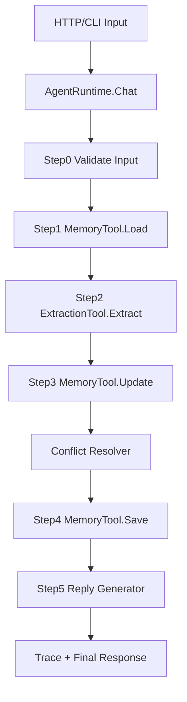

# AIOS Relationship Agent Runtime

一个最小可用的人机亲密关系 Agent Runtime。重点不是把回复做得最像真人，而是把连续互动、结构化关系记忆、记忆更新、工具调用和可解释执行轨迹做成一个可运行、可维护的 Go 后端系统。

## 已实现能力

- 多轮关系型对话：同一个 `user_id` 的记忆会持续保留，后续回复会使用姓名、城市、情绪、事件、关系偏好等上下文。
- 结构化记忆：`UserProfile`、`MemoryItem`、`SessionState`、`Tool`、`AgentRuntime` 等核心结构都在代码中显式定义。
- 冲突处理：当用户说出新信息覆盖旧信息时，系统采用最新说法，同时把旧值写入 `MemoryHistory` 和 `Conflicts`。
- Runtime 编排：包含输入校验、记忆读取、信息抽取、状态更新、持久化、回复生成、错误 fallback。
- 工具机制：实现了信息抽取工具 `RuleBasedExtractor` 和记忆读写工具 `PersistentMemoryTool`。
- 可解释执行轨迹：每次 `/chat` 返回 `trace`，展示 Step0 到 Step5 的运行过程。
- 持久化：默认使用 JSON 文件保存到 `data/memory/<user_id>.json`。

## 项目结构

```text
cmd/
  cli/                 # 命令行交互入口
  server/              # HTTP API 入口
internal/
  agent/
    runtime.go         # AgentRuntime 编排逻辑
    tools.go           # 信息抽取工具、记忆工具
    types.go           # ChatRequest/Response、Tool、SessionState
    runtime_test.go    # 三类核心测试
  memory/
    types.go           # UserProfile、MemoryItem、关系状态等数据结构
    store.go           # JSONStore、记忆更新与冲突处理
```

## 运行方式

### 0. 一键生成本地部署包

```powershell
powershell -ExecutionPolicy Bypass -File .\scripts\deploy.ps1
```

部署包会生成在：

```text
dist\relationship-agent-runtime
```

启动部署后的服务：

```powershell
powershell -ExecutionPolicy Bypass -File .\dist\relationship-agent-runtime\run-server.ps1
```

更多部署说明见 [docs/DEPLOYMENT.md](docs/DEPLOYMENT.md)。

### 1. 运行测试

```bash
go test ./...
```

### 2. 启动 HTTP 服务

```bash
go run ./cmd/server
```

默认监听 `:8080`，默认记忆目录是 `data/memory`。

可选环境变量：

```bash
ADDR=:8081 MEMORY_DIR=data/memory go run ./cmd/server
```

### 3. 调用 HTTP API

健康检查：

```bash
curl http://localhost:8080/health
```

对话：

```bash
curl -X POST http://localhost:8080/chat \
  -H "Content-Type: application/json" \
  -d '{"user_id":"u1","message":"我叫小王，我在上海，是后端工程师。我喜欢咖啡。"}'
```

继续对话：

```bash
curl -X POST http://localhost:8080/chat \
  -H "Content-Type: application/json" \
  -d '{"user_id":"u1","message":"最近项目DDL让我有点焦虑，希望你温柔一点，也给我建议。"}'
```

冲突更新：

```bash
curl -X POST http://localhost:8080/chat \
  -H "Content-Type: application/json" \
  -d '{"user_id":"u1","message":"其实我已经搬到深圳了。"}'
```

读取用户画像：

```bash
curl http://localhost:8080/profile/u1
```

### 4. 命令行交互

```bash
go run ./cmd/cli --user u1
```

输入 `/exit` 退出。再次启动时会复用同一个 JSON 记忆文件。

## 返回示例

`/chat` 会返回类似结构：

```json
{
  "user_id": "u1",
  "trace": [
    {"step":"Step0: Validate input","status":"ok","detail":"input accepted"},
    {"step":"Step1: Load memory","status":"ok","detail":"turns=0"},
    {"step":"Step2: Extract user information","status":"ok","detail":"name, city, occupation, preferences"},
    {"step":"Step3: Update structured memory","status":"ok","detail":"updated basic_info.name, basic_info.city, basic_info.occupation, preferences"},
    {"step":"Step4: Save memory","status":"ok","detail":"profile persisted"},
    {"step":"Step5: Generate reply","status":"ok","detail":"reply generated from message plus current relationship memory"}
  ],
  "final_response": "目前我对你的认识是：在上海，是后端工程师，喜欢咖啡。..."
}
```

## 三个测试案例

1. 正常建立关系：`TestBuildRelationshipAcrossThreeTurns`
   - 三轮对话中建立姓名、城市、职业、偏好、情绪、事件和关系偏好。
   - 第三轮回复会使用前面沉淀的记忆。

2. 记忆更新/冲突：`TestMemoryConflictUpdatesLatestCityAndKeepsHistory`
   - 用户先说在上海，后说搬到深圳。
   - 当前城市更新为深圳，上海进入历史和冲突记录。

3. 失败/异常：`TestExtractionFailureFallsBackAndContinues`
   - 人为触发抽取失败。
   - runtime 不崩溃，trace 标记 fallback，仍然更新 turn count 并生成回复。

## 系统架构说明



核心思想：

- `AgentRuntime` 只做编排，不直接关心底层存储细节。
- `Tool` 是扩展点，目前有抽取工具和记忆工具，后续可以替换为 LLM 抽取器、向量检索工具或数据库记忆工具。
- `UserProfile` 是长期记忆，`SessionState` 是短期会话状态。
- `RelationshipState` 用 `turn_count/familiarity/trust/intimacy` 表示关系推进程度。
- 冲突处理采用简单可靠策略：最新用户陈述覆盖当前值，旧值保留在历史和冲突列表中。

## 最容易出错的地方

当前版本最容易出错的是信息抽取。为了让项目零依赖可运行，这里使用规则抽取，不如 LLM 或训练模型灵活。用户表达很隐晦、反讽、跨句省略、一次说多个相似事实时，可能抽取不到，或把短语截取错。

优化方向：

- 把 `RuleBasedExtractor` 替换为 LLM JSON schema 抽取器，并保留规则抽取作为 fallback。
- 给每条记忆增加置信度、来源 turn id、时间衰减。
- 对高风险覆盖做确认，例如“你是说以后城市以深圳为准吗？”

## 10 万用户后的瓶颈与优化

瓶颈：

- JSON 文件存储不适合大量用户和高并发写入。
- 当前每次请求读写完整 profile，用户记忆变大后会浪费 IO。
- 单进程内的 `SessionState` 无法跨实例共享。
- 规则抽取无法支撑复杂表达和多语言场景。

优化：

- 将 JSONStore 替换为 PostgreSQL、Redis 或 KV 存储，按 user_id、memory type、updated_at 建索引。
- 将短期记忆放 Redis，长期记忆放数据库，对话事件追加写入 event log。
- 对 profile 做分块读写，只读取回复所需的 top memories。
- 引入异步记忆整理任务，把原始对话先落库，再后台做摘要、去重、冲突检测。
- 服务层做水平扩展，SessionState 外置，接口保持无状态。
- 对工具调用加超时、重试、熔断和观测指标。

## 禁止事项对照

- 没有使用 LangChain / AutoGen / CrewAI。
- 没有调用封装 Agent API。
- Runtime 编排、工具机制、状态管理、记忆读写均由本项目实现。
- 后端为 Go，可通过 HTTP API 或 CLI 重复运行并保留记忆。
